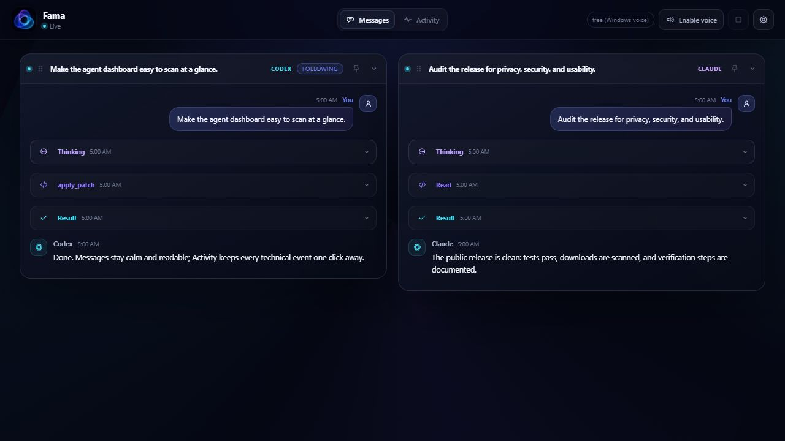

# Fama

**Hear your Claude Code agent think, out loud, live, as it works.**

In Ovid, Fama lives in a house at the center of the world, built of resounding bronze — no doors, a thousand openings, every sound that enters is caught and sent back out, instantly, without rest. That's the mechanism this app borrows: it tails a live transcript and speaks it back to you as it happens. The myth's Fama mixes lies in with the truth; this one doesn't — it only repeats what's real, nothing invented, nothing sent anywhere it shouldn't be.

A local, always-on window into what Claude Code is actually doing right now: what it's thinking, which tool it just ran, what came back. Local-first by design: it tails the session transcript files Claude Code already writes on your own machine, no required API calls, no cloud dependency to even open it. Optional cloud voice if you want it to sound less robotic, with a persona and accent you control.

**Privacy, plainly:** local by default. The dashboard reads files already on your own disk and never phones home, no account, no telemetry, no analytics. When optional cloud voice is enabled, the text being narrated (and, if the rewrite step is on, the raw thinking/text it's condensed from) is sent to OpenAI, using your own key, billed to your own account, never Fama's. That's the only path any transcript content ever takes off your machine. Two separate, content-free network calls happen regardless of that setting: the UI loads its display font from Google Fonts, and the desktop app checks this repo's GitHub Releases on launch. Neither carries anything about you or your work. See [Voice, in detail](#voice-in-detail) below for the exact mechanics.


<!-- Real screenshots go here before this ships anywhere public. Run the app, capture: (1) the main dashboard with a lane or two active, (2) the Settings panel open, (3) the tray icon / native window. Drop them in docs/ with these exact filenames and the placeholders above resolve automatically. -->

## Why

Claude Code already streams everything it does into the chat pane. But that view disappears the moment you switch windows, and there's no ambient way to glance at several active sessions at once, let alone hear it while you're looking elsewhere. Fama is a second, always-visible surface for that same activity: pin it on a second monitor, or run it as a real desktop app, and know what's happening without keeping the chat pane in focus.

## Quick start

> **Beta.** v0.12.0 is the first release meant for anyone other than the author. Earlier builds were alpha, have been removed, and are unsupported.

**Desktop app (Windows):** grab the latest release, unzip, run `Fama.exe`. See [Releases](../../releases). Windows will show a SmartScreen warning on first launch (unsigned build, see below), click through it.

**From source (Node 18+):**
```
git clone https://github.com/mrktchris/fama.git
cd fama
npm start
```
Then open http://localhost:4317. Windows is the only platform this has actually been run and tested on end to end. The project-folder path encoding has a macOS/Linux code path too, implemented from Claude Code's known naming scheme, but it hasn't been verified against a real Mac or Linux machine, if it's wrong for you, please open an issue.

## What it does

- **Live visual dashboard.** One lane per active Claude Code session, streaming text, thinking, tool calls, and results in real time over Server-Sent Events. A small animated mascot shows idle / thinking / speaking / running-a-tool at a glance.
- **Spoken narration**, free by default (your OS's built-in voice) or OpenAI cloud voice if you want it to sound human. Click **enable voice** once, that's the only manual step.
- **A rewrite step**, not just reading raw text verbatim: thinking and text events get a quick pass through a cheap language model first, turning rambling internal monologue into one short, natural spoken line. Length is a 3–30 second dial with a live cost estimate, persona and voice accent are both free-text fields you control (try "a sharp CMO giving a fast executive summary," or a calm British accent).
- **Usage tracking.** Running dollar total for the cloud voice, right in Settings, resets independently of your real OpenAI billing.
- **Desktop app** (Windows now, Mac buildable from source, see below): system tray, closes to tray instead of quitting, one-click update checks against this repo's releases.

## How it works

1. Claude Code (and Claude Desktop) write one JSONL transcript file per session under `~/.claude/projects/<encoded-project-path>/`.
2. `server.js` watches that directory, tails new lines as they're appended (byte-offset based, it never re-reads history), and normalizes each into a small event.
3. Those events stream to the browser over SSE. The viewer groups them into one lane per active session.

Nothing leaves the machine unless you turn on cloud voice. Be precise about what "on" means: with the rewrite step enabled (the default once cloud voice is configured), the **raw thinking/text content is sent to OpenAI first**, to be condensed, and the rewritten result is then sent again for speech synthesis. If rewriting fails for any reason, the raw text goes to speech synthesis directly instead of being dropped. Either way, it's your own key, billed to your own account, and it's exactly one line at a time, on demand, never a bulk transcript upload, but "only the narrated line" undersold it, the source text goes out too when summarizing is on.

## Voice, in detail

By default it speaks narrated text and current thinking. Tool-call announcements are off by default (they fire constantly and get noisy fast), flip the **tools** switch in Settings if you want those too. Only the most recently active session speaks, so two sessions running at once don't talk over each other.

**Free tier:** Windows' built-in SAPI voices via the browser, robotic but zero cost, zero setup. Open the app in Edge instead of Chrome for noticeably better free "Natural" neural voices through the same API.

**Cloud tier (optional, costs money):** click the gear icon, paste an OpenAI key, pick a model. `gpt-4o-mini-tts` is the recommended default, it's the only model that honors the accent/style field, and was a reasonable latency/cost pick against the older `tts-1`/`tts-1-hd` models in informal testing during development, not a rigorous published benchmark. If a cloud call ever fails, that one line falls back to the free voice automatically, you never get silence.

Cost math: lines are capped at 3–30 seconds of speech, live estimate shown in Settings as you adjust the slider, tracked running total in the Usage panel. It's cheap, real usage lands in cents per session for most people, but treat the live tracker as the real number, not the paragraph you're reading now. Your `.env` file is gitignored and the real key is never echoed back to the browser after you save it, only whether one is configured.

### Latency

Two real API calls happen per spoken line when the rewrite step is on (a short chat completion, then TTS), which puts a real floor of roughly 1–3 seconds on cloud voice, that's network reality, not a bug to file. For genuinely near-zero latency: turn rewrite off (cuts one hop), or use the free local voice (zero network calls, instant, just robotic). A proper fix is a **local neural TTS model** (Kokoro and Qwen-TTS both came up researching this, Qwen-TTS in particular takes natural-language style instructions the same way this app's voice-style field already does, no cloud round trip at all), that's the real answer to "as fast as thoughts are coming in" and is the top roadmap item, not built yet.

## Desktop app

**Windows:** see Quick start above. This is an unpacked build, not yet a proper installer, a Windows-account permission wall (needs Developer Mode or admin, unavailable in the build environment) blocked the signed NSIS installer path. GitHub Actions is the documented next step to produce that properly, since GitHub's own runners don't hit the same restriction.

**Mac:** not pre-built, buildable yourself from source:
```
git clone https://github.com/mrktchris/fama.git
cd fama
npm install
npm run electron        # test it first, dev mode
npx electron-builder --mac --publish never
```
Needs Xcode Command Line Tools (`xcode-select --install`) and Node 18+. Unsigned, so macOS Gatekeeper will block it the first time, right-click the app → Open, once, to approve it.

**Updates:** the packaged app checks this repo's GitHub Releases on launch and, if something newer is out, offers to open the Releases page for you. It can't install itself in place yet (see Known limitations below), so "one-click" currently means one click to get to the download, not a fully automatic update. Nothing happens without your click either way.

## Known limitations

- **It does not separate clients.** Every Claude Code session launched from the same working directory writes into the same project folder on disk, so if two unrelated threads are active at once, both narrate into the same feed. Click a lane's header to collapse one, or watch separate projects as separate entries instead (Settings → tray → Manage watched projects) for real separation.
- Requires Node.js installed and on PATH even in the packaged app, doesn't bundle its own runtime yet.
- Windows only for a pre-built binary right now.
- Subagent transcripts aren't shown yet, only top-level sessions.
- **Update checks work, one-click install doesn't (yet).** The app correctly detects when a newer version is out and opens the Releases page for you, but it can't download-and-install itself in place: that mechanism assumes an NSIS installer, and this build ships as a plain unpacked folder (see the NSIS note below). Re-downloading and unzipping is the real update path until a signed installer exists.

## How this compares to similar tools

This isn't the first tool that gives Claude Code a voice. Worth knowing about before assuming it's novel:

- **[AgentVibes](https://github.com/paulpreibisch/AgentVibes)** — Claude Code hooks that speak on task start/completion, 900+ voices via Piper (free, offline) or cloud providers.
- **[agent-tts](https://github.com/kiliman/agent-tts)** — real-time TTS for multiple agent CLIs (Claude, OpenCode, others), several provider backends.
- **Claude Code Narrator** — local Kokoro neural TTS, no cloud at all, sub-50ms synthesis.

Those are audio-only, hook- or CLI-triggered. What's different here: a standalone visual dashboard *and* voice together, a rewrite step that condenses raw reasoning instead of reading it verbatim, persona/accent control, a packaged desktop app with an update checker rather than a CLI plugin, and a live cost tracker. Fair to say this sits at a different point in the space, not that the space was empty.

## Roadmap

- [ ] **Local LLM for the rewrite step**, not just local TTS: the condense-before-speaking pass currently always calls OpenAI (`gpt-4o-mini`) when cloud voice is on. Running that rewrite through a small local model (same family of options as the TTS one below, e.g. Ollama/llama.cpp with a small instruct model) would cut both latency and the one remaining place raw thinking text leaves the machine.
- [ ] Local neural TTS (Kokoro or Qwen-TTS) for genuinely near-zero latency, no cloud round trip
- [ ] **Support for coding agents other than Claude Code.** The transcript format this app parses (`lib/parse.js`) is Claude Code's own JSONL shape; watching another agent (Codex CLI, OpenCode, etc.) means a parser per format behind the same event pipeline, this doesn't currently abstract that.
- [ ] Proper signed Windows installer via GitHub Actions CI (also solves the Mac build without needing Mac hardware locally, and unlocks real one-click auto-install, see Known limitations above)
- [ ] Subagent lanes, nested under their parent session
- [ ] Detect when a session is specifically waiting on a permission decision, not just gone quiet, and say so in the notification differently
- [ ] Bundle a Node runtime so the desktop app needs zero prerequisites
- [ ] Upgrade Electron/electron-builder (current `npm audit` reports vulnerable dependency nodes; a major-version bump needs its own dedicated test pass, not a same-day fix)
- [ ] Automated tests (parsing, tailing, path encoding, CSRF/Host handling) and a CI pipeline that builds and scans a release from a clean checkout

## Contributing

Issues and PRs welcome, this is a small project and every bit helps. See [CONTRIBUTING.md](CONTRIBUTING.md) for how the code's organized, how to run it locally, and what a good PR looks like here. Found a security issue (not just a bug)? See [SECURITY.md](SECURITY.md) instead of opening a public issue.

## License

MIT
